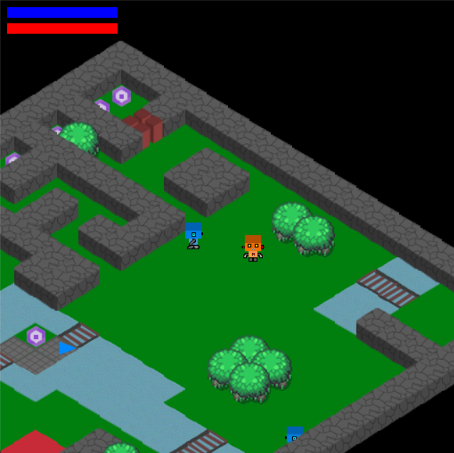
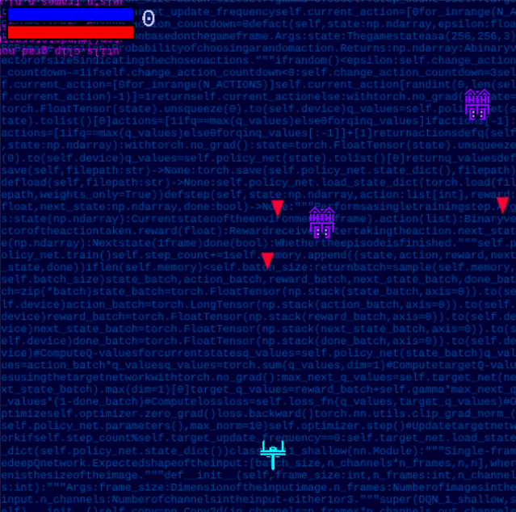
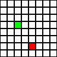

Auroral
=======

- `English (en) <#Games-to-Explore-Reinforcement-Learning>`_
- `Français (fr) <#jeux-2D-pour-explorer-lapprentissage-par-renforcement>`_

.. image:: assets/demo.gif
   :width: 500
   :align: center
   :alt: Comparison of the models. On the left, the untrained model scores 1 point over 12 seconds
      while on the right, the trained model scores 14 points over the same time frame.


Games to Explore Reinforcement Learning
---------------------------------------

2D reinforcement learning environments to test machine learning models. You can use the environment
to train agents or just play the games ``:)``.

This `video <https://www.youtube.com/watch?v=rxLh-qdvbDs>`_ presents the project and explains all
the steps required for training.


Installation
````````````

**Prerequisite**: `Python <https://www.python.org/>`_ must be installed on your system.

**First**, execute the following commands to install the repository:

.. code-block:: bash

   git clone git@github.com:Vincent-Therrien/auroral.git  # Download the repository.
   cd auroral  # Navigate inside of the repository.

**Second**, create a `virtual environment <https://docs.python.org/3/library/venv.html>`_ and
install the dependencies:

.. code-block:: bash

   # On Linux:
   python3 -m venv venv  # Create the virtual environment.
   source venv/bin/activate  # Activate the virtual environment.

   # On Windows:
   py -m venv venv  # Create the virtual environment.
   venv\Scripts\activate  # Activate the virtual environment.

   # On Linux and Windows:
   pip install -r requirements.txt  # Install Python dependencies.

**Third**, visit the page https://pytorch.org/get-started/locally/ and follow the instructions to
install PyTorch in your environment. This is required if you want to train reinforcement learning
models, but not if you just want to play the games.


Usage
`````

**Play** the game:

.. code-block:: bash

   python3 play.py  # Linux
   py play.py  # Windows

Two games are available. You can select them with the ``--game <1 or 2>`` command-line argument.
The game ``1`` consists in moving a character around a level to collect coins while avoiding
enemies and unlocking doors:



You can select a level with the command-line option ``--level <n>``, where ``n`` is between 1 and
11, inclusively. The game ``2`` consists in moving a spaceship and firing enemies to score points:



**Train** a reinforcement learning agent:

.. code-block:: bash

   python3 train.py <configuration file> --output <output directory>  # Linux
   py train.py <configuration file> --output <output directory>  # Windows

The ``<configuration file>`` is a JSON file that parametrizes the training session. You can use,
for example, the file ``training/dqn2.json``. The ``<output directory>`` is an optional parameter.
It is used to save the trained model.

**Test** a model:

.. code-block:: bash

   python3 test.py <configuration directory>  # Linux
   py test.py <configuration directory>  # Windows

The ``<configuration directory>`` is the ``<output directory>`` provided to the last command. The
repository already contains a trained model, so you can run, for instance:

.. code-block:: bash

   python3 test.py trained_models/dqn2  # Linux
   py test.py trained_models\dqn2  # Windows


Simpler Example
```````````````



The script ``example.py`` is a simple reinforcement learning task intended to quickly explore the
training process of a deep Q-Network and inspect the source code. To use it, run the command:

.. code-block:: bash

   python3 example.py  # Linux
   py example.py  # Windows

This will train the agent and periodically evaluate it. The script does not take any command-line
argument, but you are encouraged to modify the parameters written in the source code. This script is
less daunting than the other files if you are unfamiliar with neural networks.


Credit
``````

The following resources were used for this project:

- The images in the ``game 1`` are partially taken from https://opengameart.org/content/zelda-like-tilesets-and-sprites,
  by user `ArMM1998 <https://opengameart.org/users/armm1998>`_.


Further Reading
```````````````

Refer to the following papers for more details on reinforcement learning:

- For DQNs: "Playing Atari with Deep Reinforcement Learning" by Mnih et al (2015): https://www.cs.toronto.edu/~vmnih/docs/dqn.pdf.
- For CNNs: "ImageNet Classification with Deep Convolutional Neural Networks" by Krizhevsky, Sutskever, and
  Hinton: https://proceedings.neurips.cc/paper_files/paper/2012/file/c399862d3b9d6b76c8436e924a68c45b-Paper.pdf
- For backpropagation and gradient descent: "Deep Learning" by Lecun, Bengio and Hinton (2015): https://hal.science/hal-04206682/file/Lecun2015.pdf


Jeux 2D pour explorer l'apprentissage par renforcement
------------------------------------------------------

Environnements d'apprentissage par renforcement 2D pour explorer des techniques d'apprentissage
automatique. Vous pouvez utiliser les environnements pour entraîner des agents ou juste pour jouer
``:)``.

Cette `vidéo <https://www.youtube.com/watch?v=rxLh-qdvbDs>`_ présente le projet et explique les
étapes requises pour entraîner le modèle.


Installation
````````````

**Prérequis**: `Python <https://www.python.org/>`_ doit être installé sur votre système.

**Premièrement**, exécuter les commandes suivantes pour installer le projet :

.. code-block:: bash

   git clone git@github.com:Vincent-Therrien/auroral.git  # Télécharger le dépôt.
   cd auroral  # Naviguer à l'intérieur du répertoire.

**Deuxièmement**, créez un `environnement virtuel <https://docs.python.org/fr/3.13/library/venv.html>`_
et installez les dépendances :

.. code-block:: bash

   # Avec Linux:
   python3 -m venv venv  # Créer l'environnement virtual.
   source venv/bin/activate  # Activer l'environnement virtuel.

   # Avec Windows:
   py -m venv venv  # Créer l'environnement virtual.
   venv\Scripts\activate  # Activer l'environnement virtuel.

   # Avec Linux et Windows:
   pip install requirements.txt  # Installer les dépendances Python.

**Troisièmement**, visitez la page https://pytorch.org/get-started/locally/ et suivez les
instructions pour installer la bibliothèque PyTorch. Elle est requise pour entraîner des agents
mais pas pour jouer aux jeux.


Usage
`````

Pour **jouer** :

.. code-block:: bash

   python3 play.py  # Linux
   py play.py  # Windows

Deux jeux sont disponibles. Vous pouvez les sélectionner avec l'option ``--game <1 or 2>``. Le
jeu ``1`` consiste à d.placer un personnage dans un niveau pour collecter des points tout en
évitant des ennemis :


Vous pouvez sélectionner un niveau avec l'option ``--level <n>``, où ``n`` est un nombre compris
entre 1 et 11, inclusivement. Le jeu ``2`` consiste à déplacer un vaisseau et à tirer sur des
ennemis pour marquer des points.


Pour **entraîner** des agents :

.. code-block:: bash

   python3 train.py <fichier de configuration> --output <répertoire de sortie>  # Linux
   py train.py <fichier de configuration> --output <répertoire de sortie>  # Windows

Le ``<fichier de configuration>`` est un fichier au format JSON qui paramétrise la session
d'entraînement. Vous pouvez utiliser, par exemple, le fichier ``training/dqn2.json``. Le
``<répertoire de sortie>`` est un paramètre optionnel utilisé pour sauvegarder le modèle entraîné.

Pour **tester** un modèle :

.. code-block:: bash

   python3 test.py <répertoire de configuration>  # Linux
   py test.py <répertoire de configuration>  # Windows

Le ``<répertoire de configuration>`` est le ``<répertoire de sortie>`` fourni à la commande
précédente. Le répertoire contient déjà  un modèle entraîné que vous pouvez utiliser tel quel :

.. code-block:: bash

   python3 test.py trained_models/dqn2  # Linux
   py test.py trained_models\dqn2  # Windows


Exemple simple
``````````````


Le script ``example.py`` est une tâche simple conçue pour explorer rapidement l'apprentissage par
renforcement sur des systèmes peu performants. Exécutez la commande suivante pour l'utiliser :

.. code-block:: bash

   python3 example.py  # Linux
   py example.py  # Windows

Le script entraîne un modèle et l'évalue périodiquement. Le code source est plus court et plus
simple à comprendre que les autres tâches dans le dépôt, alors c'est un bon point de départ si vous
êtes peu familier avec les réseaux neuronaux.


Remerciements
`````````````

Les ressources suivantes ont été utilisées pour réaliser ce projet :

- Les images du jeu ``game 1`` sont partiellement tirées de https://opengameart.org/content/zelda-like-tilesets-and-sprites,
  par l'utilisateur `ArMM1998 <https://opengameart.org/users/armm1998>`_.


Références
``````````

Les articles suivants contiennent des informations complémentaires au projet.

- DQN : "Playing Atari with Deep Reinforcement Learning" by Mnih et al (2015): https://www.cs.toronto.edu/~vmnih/docs/dqn.pdf.
- CNN : "ImageNet Classification with Deep Convolutional Neural Networks" by Krizhevsky, Sutskever, and
  Hinton: https://proceedings.neurips.cc/paper_files/paper/2012/file/c399862d3b9d6b76c8436e924a68c45b-Paper.pdf
- Rétropropagation et descente de gradients : "Deep Learning" by Lecun, Bengio and Hinton (2015): https://hal.science/hal-04206682/file/Lecun2015.pdf
